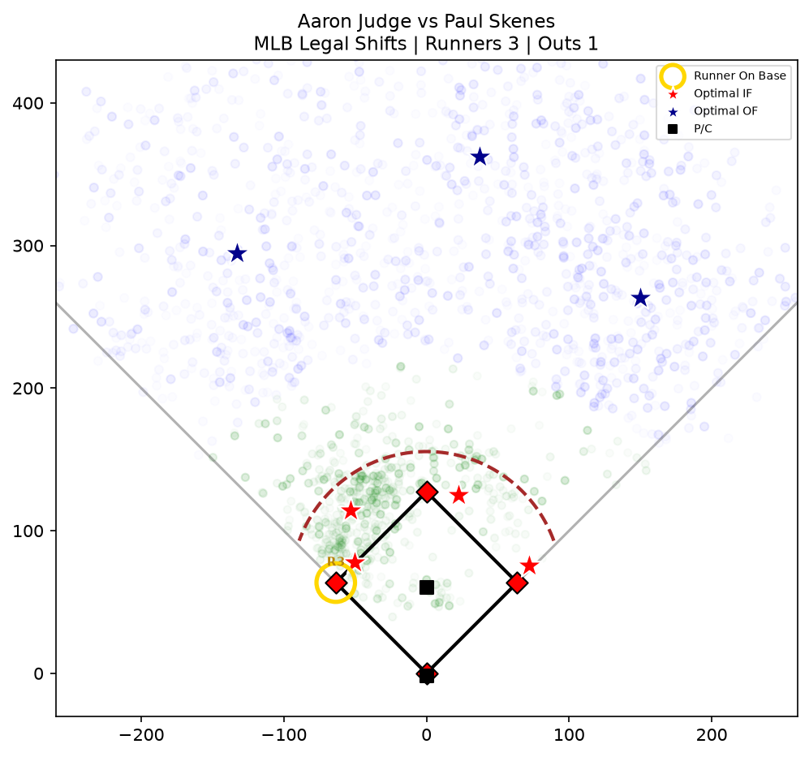

# Baseball Defender Positioning

Where should the defense stand against *this* hitter facing *this* pitcher?

A Python tool that computes optimal fielder positions for a specific batter-vs-pitcher matchup. It weights a batter's career batted balls by how closely each one resembles the pitches the opposing pitcher actually throws, then places seven fielders with a constrained k-means that enforces the 2023 MLB anti-shift rules.



## How it works

**1. Weight the batted balls by matchup.** Not every ball a hitter has put in play is relevant against a given pitcher. Each batted ball is weighted by how often the pitcher throws that pitch type and how close the velocity is to his average for it:

```
weight = usage% × exp( −(pitcher_avg_velo − pitch_velo)² / 2σ² )    σ = 4 mph
```

Pitch types the pitcher doesn't throw get a weight of zero. Anything under 0.05 is dropped. A pitcher who lives on a 100 mph fastball is scouted against the balls that hitter has put in play on high-velocity fastballs — not his career spray chart.

**2. Convert Statcast hit coordinates to feet.** Baseball Savant reports landing spots in screen pixels, with home plate at (125, 204.5) and the y-axis inverted:

```
x = (hc_x − 125) × 2.43
y = (204.5 − hc_y) × 2.43
```

**3. Cluster into positions.** Balls between 45 and 220 feet with a launch angle under 50° are infield; anything past 220 feet is outfield. A weighted k-means places four infielders with the pitcher and catcher pinned at (0, 60.5) and (0, −2); a separate unconstrained three-cluster fit places the outfielders.

**4. Enforce legality on every iteration.** The 2023 rule changes are applied as a projection inside the fitting loop, in order:

| | Constraint |
|---|---|
| 1 | **Leash** — first baseman pulled back toward the bag if he strays past his max distance |
| 2 | **Two per side** — third baseman and shortstop clamped to `x ≤ −1`, second baseman and first baseman to `x ≥ +1` |
| 3 | **On the dirt** — any infielder more than 95 ft from the mound is scaled back to exactly 95 ft |
| 4 | **Fair territory** — points outside the foul lines are projected orthogonally onto the nearest one |

Because the projection runs inside the loop rather than as a cleanup pass, the clusters converge to positions that are already legal instead of being dragged into legality afterward.

The leash ordering matters more than it looks. First base sits *on* the foul line, so pulling a first baseman toward the bag can push him across it — the fair-territory projection has to get the last word. It is safe to run the leash first because the dirt clamp only ever pulls a fielder closer to the mound, and the foul-line projection is orthogonal onto a line through the bag, so neither can push him back outside his leash.

## Situational adjustments

Game state changes the alignment. Gravity blends the computed position toward a target: `proposed × (1 − strength) + target × strength`. A leash is a hard cap on distance, applied after everything else.

| Trigger | Adjustment |
|---|---|
| Runner on first | First baseman pulled to the bag (95% gravity, 3 ft leash) |
| No runner on first | First baseman free to follow the hit density, but leashed to 30 ft of the bag so he can still cover it |
| Runner on first, fewer than 2 outs | Shortstop and second baseman pulled toward second for double-play depth (35% gravity each) |
| Runner on third, fewer than 2 outs, 7th inning or later | Infield in — depth cut to 82% |
| 2 outs, 7th inning or later | Outfield pushed back 25 ft |

The 30 ft cover leash is not arbitrary: first base is 63.7 ft from the mound, so a 30 ft radius around it tops out at 93.7 ft — just inside the 95 ft grass line. The first baseman stays on the dirt for free.

Depth adjustments scale the y-axis only. Scaling both axes would pull the middle infielders toward the centerline as a side effect of coming in.

## Running it

Must be run from the repo root — data paths are relative to the working directory.

```bash
python3 -m venv .venv
.venv/bin/pip install -r requirements.txt
.venv/bin/python main.py
```

The menu offers batter download, pitcher download, and the simulator. To skip straight to the plot:

```bash
.venv/bin/python display.py    # prompts: batter, pitcher, outs, runners, inning
```

No API keys or environment variables — Baseball Savant is public.

## Getting data

**The repo ships the downloaders, not the data.** Statcast data belongs to MLB Advanced Media, so `Batters/` and `Pitchers/` are gitignored. A fresh clone has no data and you populate it yourself, which takes two menu options:

```bash
.venv/bin/python main.py
#  [1] Add / Update Batter Data   -> enter "Aaron Judge"
#  [2] Add / Update Pitcher Data  -> enter "Paul Skenes"
#  [3] Run Defensive Simulator
```

The downloader pulls a full career from debut to the present, one file per season, skipping seasons already on disk and always re-fetching the current year. The pitcher downloader also derives that pitcher's arsenal summary (`pitches.csv`: usage %, average and max velocity per pitch type), which the simulator needs — you need at least one batter and one pitcher before the simulator will run.

For reference, the matchups this was developed against:

| Player | Seasons | Rows |
|---|---|---|
| Aaron Judge | 2016–2025 | 3,005 batted balls |
| Shohei Ohtani | 2018–2025 | 2,784 batted balls |
| Cal Raleigh | 2021–2025 | 1,585 batted balls |
| Tarik Skubal | 2020–2025 | 13,332 pitches |
| Paul Skenes | 2024–2025 | 5,267 pitches |

Pulled from MLB Statcast via [pybaseball](https://github.com/jldbc/pybaseball).

## Tests

```bash
.venv/bin/python -m unittest discover -s tests
```

46 tests, standard-library `unittest`, no extra dependencies. The unit tests cover the coordinate transform, the foul-line and anti-shift projections, the bag leash, and the constrained k-means. The integration tests drive `display.py` end to end through its real prompt loop, building a synthetic dataset in a temp directory — so they pass on a fresh clone with no downloaded data, and can deterministically hit the sparse-data fallback that real data never triggers. Three data-contract tests check that downloaded CSVs still carry every column the code reads; they skip when there's no data.

## Stack

Python 3 · pandas · numpy · scikit-learn · matplotlib · pybaseball

No database, no server, no config. The plot window supports cursor-centered scroll-wheel zoom.

## Known limits

- **Outs and inning only matter through the five rules above.** There is no run-expectancy model behind them.
- **No way to save or compare outputs.** Every run is one interactive plot.
- **The sparse-data fallback is crude.** Below five infield batted balls the tool drops to hardcoded positions. Situational adjustments and legality still apply, but the alignment is generic rather than matchup-specific.
- **Pitch types missing from the arsenal map are dropped silently.** An unrecognized `pitch_name` falls through as its full name, never matches the batter file's abbreviation, and those batted balls get weight zero with no warning.
- **Career data is pooled flat.** A hitter's 2016 batted balls count the same as his 2025 ones — no recency weighting, no park adjustment, no platoon split.

---

*Statcast data is property of MLB Advanced Media. This is a personal project, not affiliated with MLB.*
